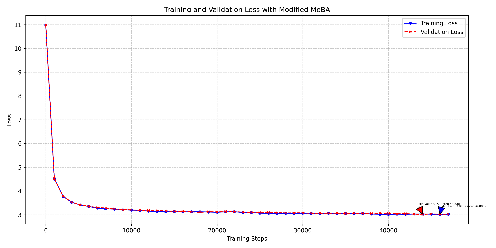

# nanoGPT with Modified MOBA Attention

## Overview

This repository contains a clean, efficient PyTorch implementation of GPT models with support for:
- Training from scratch
- Fine-tuning pre-trained models
- Sampling from trained models
- MOBA attention mechanism for better efficiency

## Features

- **MOBA Attention**: Efficient attention mechanism with configurable chunks and top-k selection

## Training Results

Trained with default MoBA parameters(see below)

## Datasets

Supported datasets include:
- OpenWebText (for pre-training)
- Shakespeare (for fine-tuning examples)
- Shakespeare Character-level (for fine-tuning)
- FineWeb (educational web content)

## MOBA Attention

MOBA (Mixture-of-Block Attention) is an efficient attention mechanism that reduces computation by:
1. Dividing the input sequence into chunks
2. Selecting a combination of fixed and dynamic chunks based on relevance
3. Mixing traditional causal attention with chunk-based attention

Key parameters:
- `moba_chunk_size`: Size of chunks (default: 128)
- `moba_topk`: Number of dynamic chunks to select (default: 3)
- `moba_fixed_blocks`: Ratio of fixed chunks to always use (default: 0.1)
